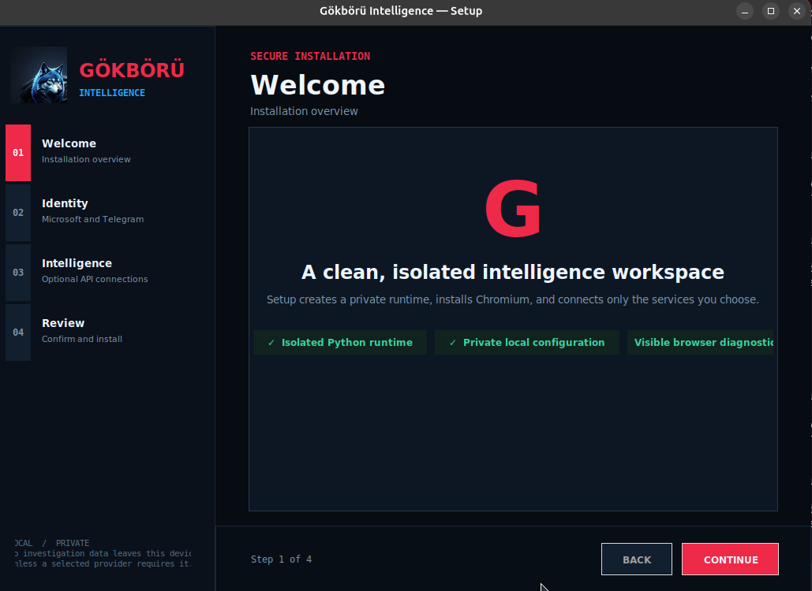
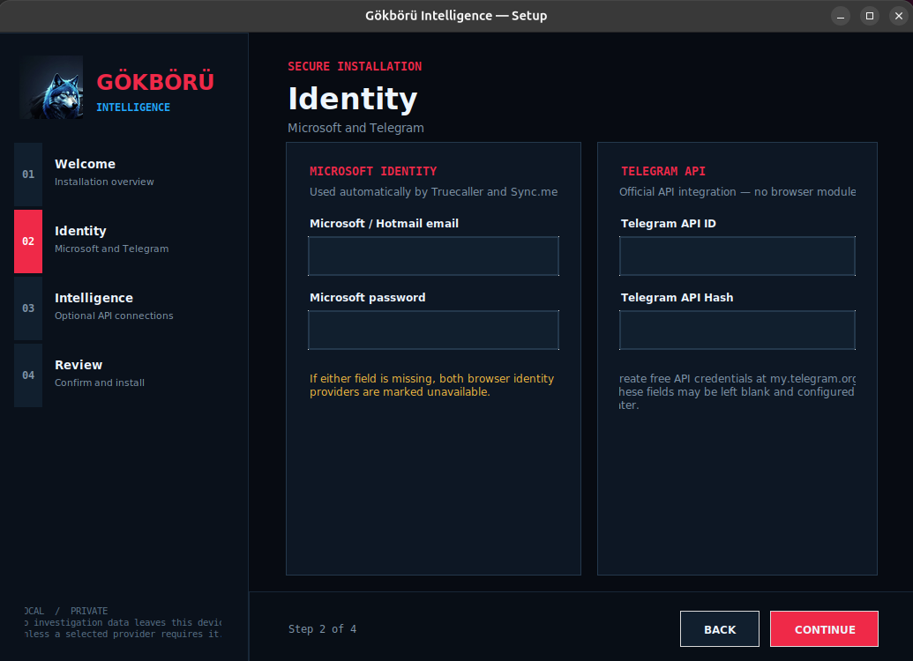
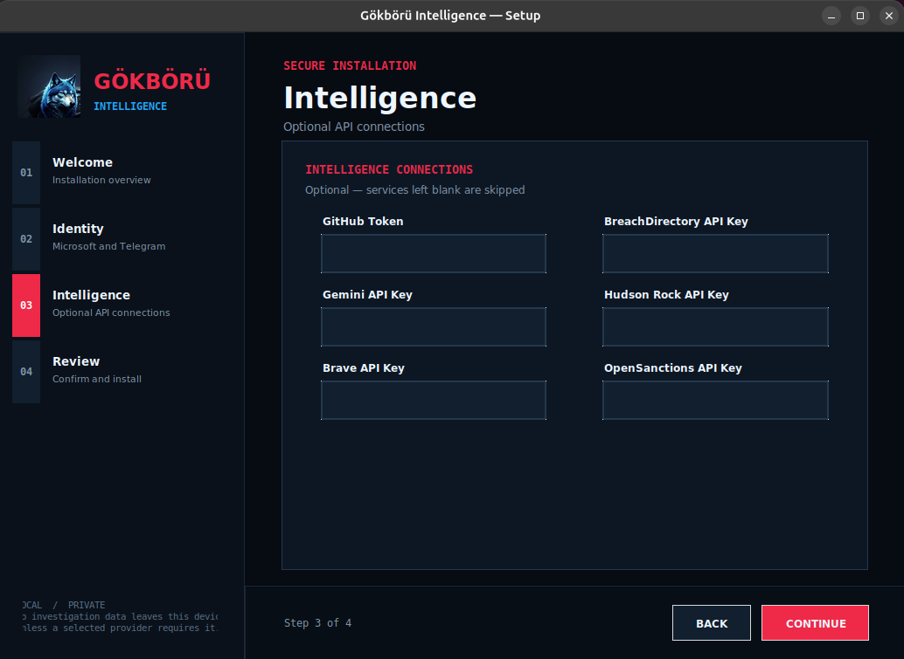
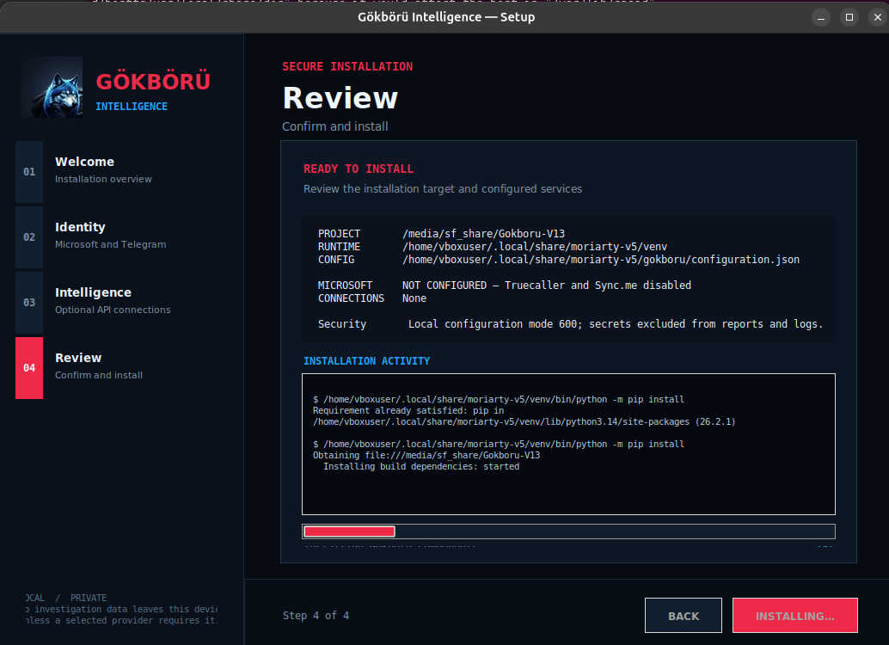
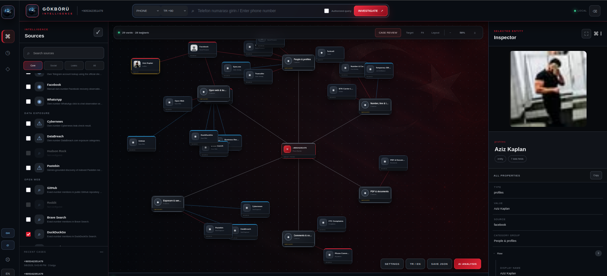
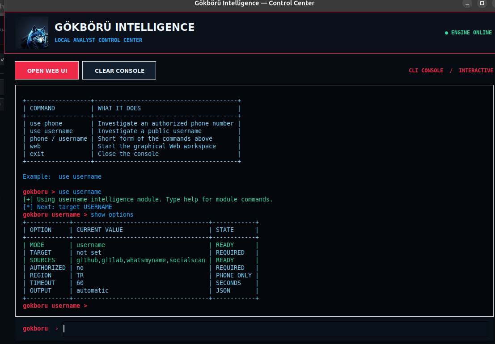
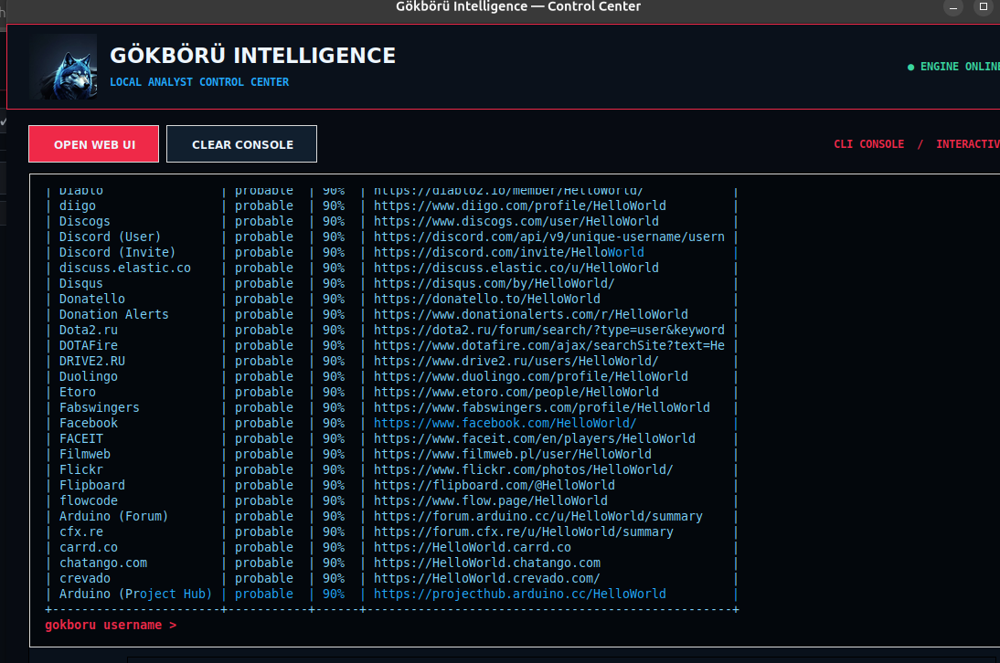

<p align="center">
  
</p>

<h1 align="center">Gökbörü Intelligence</h1>

<p align="center">Phone and username investigations · Web GUI & CLI</p>

## Installation

Download and extract the project. Open a terminal in the project folder on Ubuntu:

```bash
bash ./install.sh
```

### 1. Welcome

Click **Continue** to begin.



### 2. Identity

Enter your Microsoft account for Truecaller and Sync.me, and Telegram API details if you use Telegram. Services left unconfigured will be unavailable.



### 3. Intelligence

Add API keys for the services you want to use. Optional fields can be left blank.



### 4. Review & Install

Review your choices, click **Install**, and wait for setup to finish.



## Web GUI

```bash
bash ./moriarty-local web-workspace
```

Open **http://127.0.0.1:8765/** if the page does not open automatically.

1. Choose **Phone** or **Username** and enter your target.
2. Select sources and confirm **Authorized query**.
3. Click **Investigate**.
4. Select a result to view its details, or open **Case Review** to browse results by category.



## CLI Console

```bash
bash ./moriarty-local
```

Type `help` to see available commands. Use `use phone` or `use username` to select a module.



Example username search:

```text
use username
target YOUR_USERNAME
sources quick
authorized yes
run
```

After the scan, use `show results` for the report, `show profiles` for profiles, or `show breaches` for exposure findings.



---

Use only for queries you are authorized to perform.

[AzizKpln](https://github.com/AzizKpln) · [AzizKpln@protonmail.com](mailto:AzizKpln@protonmail.com)
